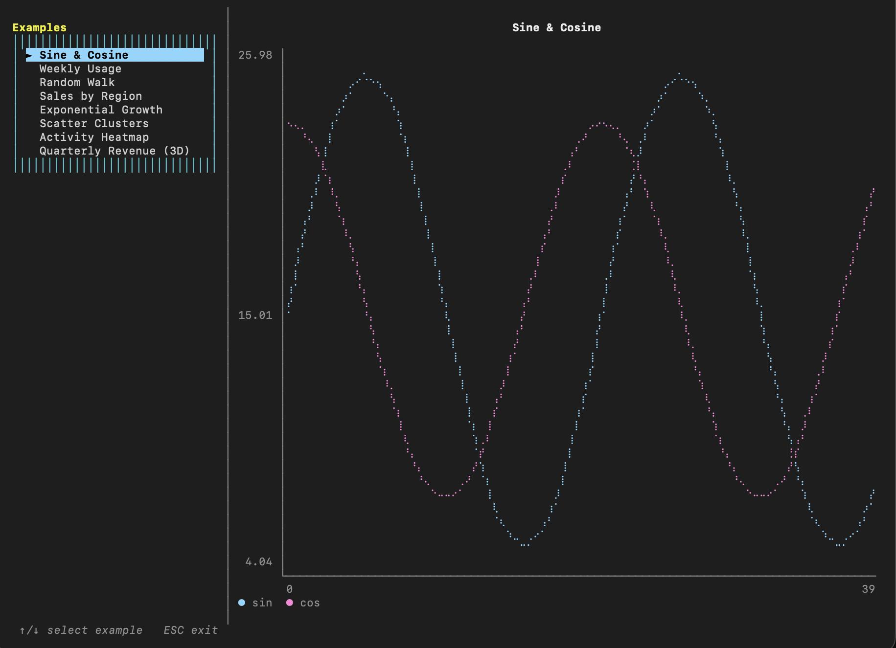

# SwiftyTermUI

> **Note:** This project is currently under development. Builds and passes tests on macOS and Linux (Ubuntu arm64/amd64, Swift 6.2). Interactive terminal behavior is primarily tested on macOS.




&nbsp;

SwiftyTermUI consists of three main parts:
- **Low-level engine**: A Swift analogue of `ncurses` for direct terminal control and drawing primitives, built from scratch without any external dependencies.
- **High-level framework**: An attempt to recreate the classic `Turbo Vision` experience in a modern context.
- **SwiftyGraph**: A charting module for rendering line, bar, scatter, heatmap, and pseudo-3D charts directly in the terminal.

## Main API

```swift
let tui = SwiftyTermUI.shared

// Initialize terminal
try tui.initialize()

// Draw content
tui.drawString(row: 0, column: 0, text: "Hello")
tui.drawChar(row: 1, column: 0, character: "A", attributes: TextAttributes(bold: true))

// Render to terminal
try tui.refresh()

// Read input
if let event = tui.readEvent() {
    switch event {
    case .keyPress(let key):
        // Handle key
    case .terminalResize:
        // Handle resize
    }
}

// Cleanup
tui.shutdown()
```

## SwiftyGraph

SwiftyGraph is a bundled charting library built on top of SwiftyTermUI. It renders line charts, bar charts, scatter plots, heatmaps, and pseudo-3D bar charts directly in the terminal using Braille-based canvases.

```swift
import SwiftyGraph
import SwiftyTermUI

LineChart(
    series: [
        GraphSeries(name: "sin", values: sine, color: GraphPalette.color(at: 0)),
        GraphSeries(name: "cos", values: cosine, color: GraphPalette.color(at: 1)),
    ],
    title: "Sine & Cosine"
).render(in: tui, row: row, column: column, width: width, height: height)
```

Try the interactive demo, which cycles through all chart types:
```bash
swift run GraphDemo
```

## Examples

SwiftyTermUI includes several examples demonstrating different features:

| Example | Description |
|---------|-------------|
| `HelloTermUI.swift` | Basic setup and text drawing with colors and attributes |
| `DrawingExample.swift` | Lines, rectangles, and geometric shapes drawing |
| `WindowExample.swift` | Window management, panels, and window stacking |
| `InputExample.swift` | Keyboard input handling including special keys |
| `ComponentsExample.swift` | High-level components (Menu, Form, Button, TextBox, ProgressBar) |
| `OptimizationExample.swift` | Demonstrates render optimization features and statistics |
| `RetroDemo.swift` | A comprehensive demo of retro-styled UI components and interactions |
| `GraphDemo.swift` | Interactive showcase of SwiftyGraph chart types (line, bar, scatter, heatmap, pseudo-3D) |

Run any example with:
```bash
swift run <ExampleName>
```
